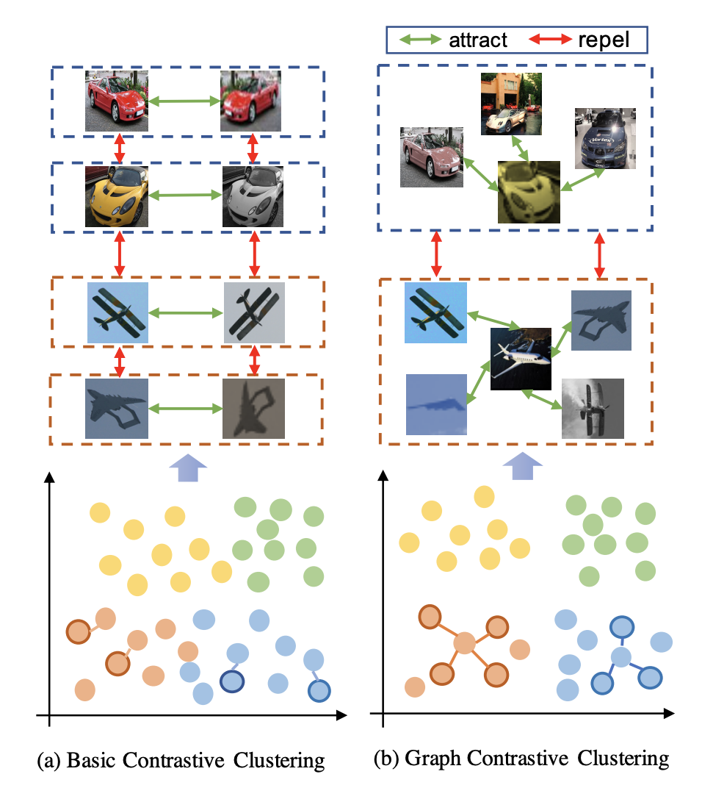
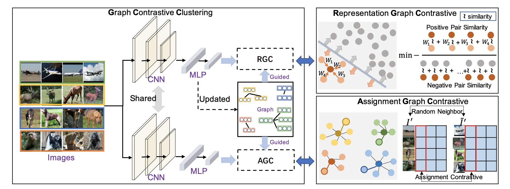
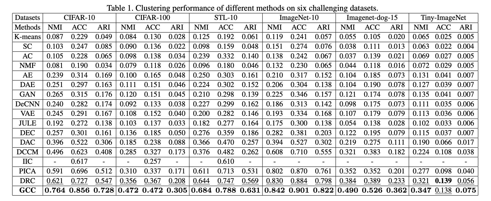

# Graph Contrastive Clustering

This repo contains the Pytorch implementation of our paper:
> [Graph Contrastive Clustering](https://arxiv.org/abs/2104.01429)
>
> [Huasong Zhong\*](https://scholar.google.com/citations?user=BLE1mzgAAAAJ&hl=zh-CN), [Jianlong Wu\*](https://jlwu1992.github.io), [Chong Chen^](https://scholar.google.com/citations?user=DyeODPUAAAAJ&hl=en), [Jianqiang Huang](https://scholar.google.com.hk/citations?user=UqAybqgAAAAJ&hl=en), 
> [Minghua Deng](https://scholar.google.com/citations?user=u7NoLQYAAAAJ&hl=zh-CN), [Liqiang Nie](https://scholar.google.com/citations?user=yywVMhUAAAAJ&hl=en), [Zhouchen Lin](https://zhouchenlin.github.io), [Xian-Sheng Hua](https://scholar.google.com/citations?user=6G-l4o0AAAAJ&hl=zh-CN)(^ Corresponding author.)
- Accepted at ICCV 2021.


## Contents

1. [Introduction](#introduction)
0. [Installation](#installation)
0. [Training](#train)
0. [Testing](#test)
0. [Self-labeling](#self-labeling)
0. [Results](#results)
0. [Models](#models)
0. [Citation](#citation)

## Introduction

- Different from basic contrastive clustering that only assumes an image and its augmentation should share similar representation and clustering assignments, we lift the instancelevel consistency to the cluster-level consistency with the assumption that samples in one cluster and their augmentations should all be similar.

<p align="center" >
    

- Motivation of GCC. (a) Existing contrastive
learning based clustering methods mainly focus on instancelevel consistency, which maximizes the correlation between selfaugmented samples and treats all other samples as negative samples. (b) GCC incorporates the category information to perform
the contrastive learning at both the instance and the cluster levels,
which can better minimize the intra-cluster variance and maximize
the inter-cluster variance.


<p align="center">
    

-  Framework of the proposed Graph Contrastive Clustering. GCC has two heads with shared CNN parameters. The first head is a
representation graph contrastive (RGC) module, which helps to learn clustering-friendly features. The second head is an assignment graph
contrastive (AGC) module, which leads to a more compact cluster assignment.

## Installation
```shell
pip install -r requirements.txt
```

## Train
```shell
CUDA_VISIBLE_DEVICES=0 python end2end.py --config_env configs/env.yml --config_exp configs/end2end/end2end_cifar10.yml
CUDA_VISIBLE_DEVICES=0 python end2end.py --config_env configs/env.yml --config_exp configs/end2end/end2end_cifar20.yml
CUDA_VISIBLE_DEVICES=0 python end2end.py --config_env configs/env.yml --config_exp configs/end2end/end2end_imagenet10.yml
CUDA_VISIBLE_DEVICES=0 python end2end.py --config_env configs/env.yml --config_exp configs/end2end/end2end_imagenet_dogs.yml
CUDA_VISIBLE_DEVICES=0 python end2end.py --config_env configs/env.yml --config_exp configs/end2end/end2end_tiny_imagenet.yml
CUDA_VISIBLE_DEVICES=0 python end2end.py --config_env configs/env.yml --config_exp configs/end2end/end2end_stl10.yml
```

## Test
```shell
CUDA_VISIBLE_DEVICES=0 python test_end2end.py --config_env configs/env.yml --config_exp configs/end2end/end2end_cifar10.yml
CUDA_VISIBLE_DEVICES=0 python test_end2end.py --config_env configs/env.yml --config_exp configs/end2end/end2end_cifar20.yml
CUDA_VISIBLE_DEVICES=0 python test_end2end.py --config_env configs/env.yml --config_exp configs/end2end/end2end_imagenet10.yml
CUDA_VISIBLE_DEVICES=0 python test_end2end.py --config_env configs/env.yml --config_exp configs/end2end/end2end_imagenet_dogs.yml
CUDA_VISIBLE_DEVICES=0 python test_end2end.py --config_env configs/env.yml --config_exp configs/end2end/end2end_tiny_imagenet.yml
CUDA_VISIBLE_DEVICES=0 python test_end2end.py --config_env configs/env.yml --config_exp configs/end2end/end2end_stl10.yml
```

## Self-labeling
```shell
CUDA_VISIBLE_DEVICES=0 python selflabel.py --config_env configs/env.yml --config_exp configs/selflabel/selflabel_cifar10.yml
CUDA_VISIBLE_DEVICES=0 python selflabel.py --config_env configs/env.yml --config_exp configs/selflabel/selflabel_cifar20.yml
CUDA_VISIBLE_DEVICES=0 python selflabel.py --config_env configs/env.yml --config_exp configs/selflabel/selflabel_stl10.yml
```

## Results

<p align="center">
    

- Our results are 12.9%, 10.5%, 4.1% higher than that of the second best method [DRC](https://arxiv.org/abs/2008.03030) on CIFAR10, CIFAR-100 and STL-10, respectively. The results have some volatility, which can be improved by more attempts.

## Models

| Dataset          | Loss              | ACC                   |  NMI            |  ARI      |Download link |
|------------------|-------------------|---------------------- |-----------------|-----------|--------------|
| CIFAR-10          |  RGC+AGC        | 85.9                  | 77.2            | 73.4      |[Download](https://drive.google.com/drive/folders/1wBXq_WNeST7XBc_aD-200yCOgd_DosgV?usp=sharing)  |
| CIFAR-100         |  RGC+AGC        | 48.1                  | 48.1            | 31.8      |[Download](https://drive.google.com/drive/folders/1Q66j3Dh8H3lSMjEq7iqDRo-vres6Wgcr?usp=sharing)  |
| STL-10            |  RGC+AGC        | 78.0                  | 68.6            |  63.5     |[Download](https://drive.google.com/drive/folders/1MK8YXSJoEqh2kYrvQzq3J3R5PDUP5Uw_?usp=sharing)  |
- Set the 'root_dir' in config/env.yml to the download models and run the test scripts.

## Citation 

If you use GCC in your research or wish to refer to the baseline results published in this paper, please use the following BibTeX entry.

```bibtex
@inproceedings{zhong2021graph,
  title={Graph Contrastive Clustering},
  author={Zhong, Huasong and Wu, Jianlong and Chen, Chong and Huang, Jianqiang and Deng, Minghua and Nie, Liqiang and Lin, Zhouchen and Hua, Xian-Sheng},
  booktitle={IEEE ICCV},
  year={2021}
}
